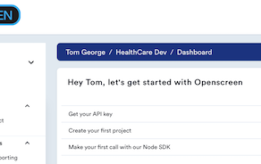
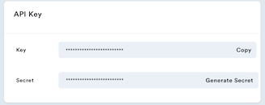
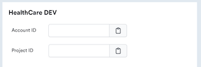
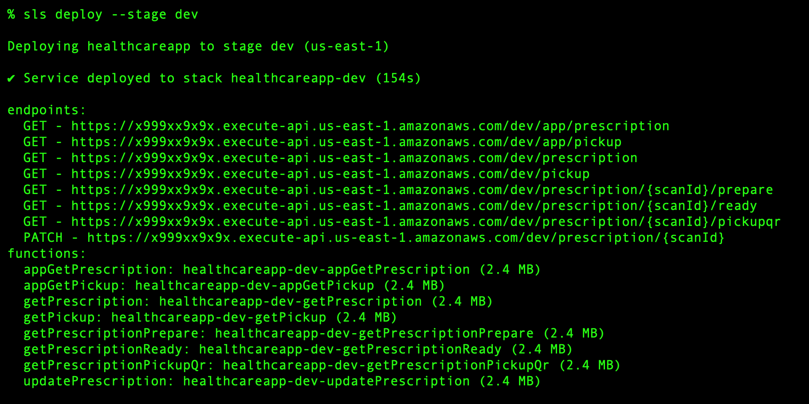

# Healthcare

> Additionnal information regarding this example and other sample applications
> can be found in the [Code Locker][LOCKER] section of the developer [documentation][DOCS].
> Please note that these sample applications are for demonstration purposes only
> and should not be used in production applications.


## About

This Code Locker application is a proof of concept implementation
of a QR code scenario in a healthcare setting.
The scenario is outlined [here](https://docs.openscreen.com/docs/developer-portal/code-locker/health-care/)
on the [Openscreen developer documentation portal](https://docs.openscreen.com/docs/).
It demonstrates a simple touchless fulfillment scenario for prescriptions.


 * A patient, called Lucy, is given a script from her doctor at her clinic.
 * The script has a QR code on it which gives allows her to "drop off"
the prescription at a pharmacy.
 * She scans the QR code, enters her phone number to verify her identity, and then
selects her pharmacy from a list already in her records.
 * A link to the prescription is sent by text to her pharmacy and the pharmacist
clicks on the link to see the prescription and begin the fulfillment process.
 * Lucy receives a notification that her prescription is being prepared and
that she'll receive a notification when it's ready.
 * Once the pharmacist has Lucy's prescription ready, he clicks on a second link
provided in the original text to notify her.
 * Lucy receives a text notification informing her that the prescription is ready.
 * It includes a QR code which the pharmacy can use to locate her records and prescription.
 * When she arrives at the pharmacy, she presents the QR code to the person at
the pick-up counter who scans it and gives Lucy her medication, completing the
prescription fulfillment process.


### How it works

At the clinic office the prescription system uses Openscreen to:

* Create an Asset in Openscreen and store a digital copy of the prescription with that Asset
* Generate a QR code to be affixed to the prescription
* Associate Lucy's contact information with the Asset
* Associate the list of Lucy's usual pharmacies with the Asset
* Generate a QR code that Lucy will present to the pharmacy when she picks up her medication.

All of the data surrounding the workflow is associated with the Asset in Openscreen.

When either of the QR codes is scanned, Openscreen launches the client app
and the client app is able to access the data for the transaction and also
update the state of the asset.

The clients app sends messages directly to the participants using Openscreen
and providing links to trigger the next steps.

Openscreen tracks scans and manages the Asset state.

### Technology stack

This app is built entirely in JavaScript and has three parts:

- A `new-prescription` command that generates the fictitious prescription
- A small API implemented using AWS API Gateway and Lambda functions
- A single page HTML "app" (also implemented using AWS API Gateway and Lambda)
that processes the acceptance of the prescription by Lucy.
The other interactions happen through text messages, links, and QR codes.

The cloud portion of the app is deployed using
[Serveless](https://www.serverless.com/framework/docs/getting-started)

## Setup

#### 1. Install Node and Serverless

If you don't have these already, you'll need to install the following:

-   [Node.js v14+](https://nodejs.org/en/download/)
-   NPM v6+ (comes installed with newer Node versions)
-   [Severless v3.7.1+](https://www.serverless.com/framework/docs/getting-started)

#### 2. Clone the repository

`$ git clone git@github.com:openscreen-tv/code-locker.git`

You'll find _this_ project under the `./healthcare` folder.

#### 3. Install the dependencies

On a terminal in this directory and run the `npm install` command. This will also
install the dependencies defined in the in the `api` folder.

#### 4. Get your Openscreen information



Create a (free) [Openscreen account](https://app.openscreen.com/signup) then
generate your API key and secret.



Then create a Project.



You'll need the API key, secret, account id, and project id for the environment
settings required by the app.

Rename the file named `EDIT-THIS!.env` to `.env` and replace set the values:

```
OS_KEY=XXXXXXXXXXXXXXXXXX
OS_SECRET=XXXXXXXXXXXXXXXXXXXXXXXX
ACCOUNT_ID=AA9999AA9999AA
PROJECT_ID=XXXXXXXX-XXXX-XXXX-XXXX-XXXXXXXXXXXX
```

#### 5. Update the "fake" data

In the source file `./healthcare/scripts/create-resources.js` you'll find an number of
`@TODO` tags where the script creates contacts to be associated with the prescription
(Asset), like:

```
const clinic = {
  firstName: 'City Clinic',
  cellPhone: '+12015551212', // @TODO: EDIT THIS
  type: ContactRoles.CLINIC,
}
```

If you want to, you can put real cell phone numbers there and play out the
scenario with other people.

As an alternative, in the `.env` file, uncomment and edit the line that says:

```# PHONE_OVERRIDE=+12015551212```

If you put your own phone number here, all SMS messages from the app will be
sent to your phone.

#### 6. Deploy the API using Serverless

Now you'll need to deploy the App to your AWS account.

Assuming your AWS credentials and config are set up, you can use the
following command:

`sls deploy --stage dev`

If you have more than one Amazon AWS account configured, you may need to use
the option `--aws-profile` or set the environment variable `AWS_PROFILE`
to indicate which profile you want to use.

Your output should look like this:



#### 7. One last `.env` setting

In order for the `new-prescription` command to run, you need to update the
.env file under `./healthcare` with the API Gateway endpoint that you see in
the Serverless deployment output.
In this case:

`API_ENDPOINT=https://x999xx9x9x.execute-api.us-east-1.amazonaws.com/dev`

Now you're ready to run the scenario.

#### 7. Create a Prescription

With your app deployed to AWS and your `.env` file updated,
you can now create your first Prescription and the QR codes associated with it.

From the `./healthcare/scripts` folder run the following command:

`./new-prescription`

You should see a file appear under the `./healthcare/scripts` folder called: `QrCodeOnPrescription.png`

Open the PNG file and the QR code should display on your screen.

_On the Mac from Terminal use the following command:_ `open ./scripts/QrCodeOnPrescription.png`

Scan it to begin the scenario.

## Links

- [Openscreen website][Openscreen]
- [Developer Documentation][DOCS]
- [JavaScript SDK][SDK]
- [Additional Examples and Use Cases][LOCKER]

[Openscreen]: https://openscreen.com
[DASH]: https://app.openscreen.com
[SDK]: https://github.com/openscreen-tv/openscreen-sdk
[LOCKER]: https://docs.openscreen.com/docs/developer-portal/node-sdk/code-locker/overview/
[DOCS]: https://docs.openscreen.com/docs/
[NODE]: https://nodejs.org/en/
[SLS]: https://www.serverless.com
[AWS]: https://aws.amazon.com
